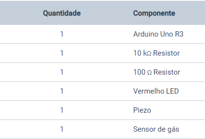

# Detector-De-Fumaca
Projeto de um detector de fumaça utilizando arduino 
A idéia foi simular um dectector de fumaça que quando entende que há fumaça, 
uma led vermelha se acende e ele emite um som. 
Link do projeto: https://www.tinkercad.com/embed/by9YELjhWfI

Este circuito foi feito no tinkercad utilizando os seguintes componentes: 
 

O circuito foi criado conforme a imagem abaixo:
 

Utilizando a programação em blocos, o código ficou assim: 
 

<a href="DetectorDeFumaca.ino">Clique aqui para o código</a>
